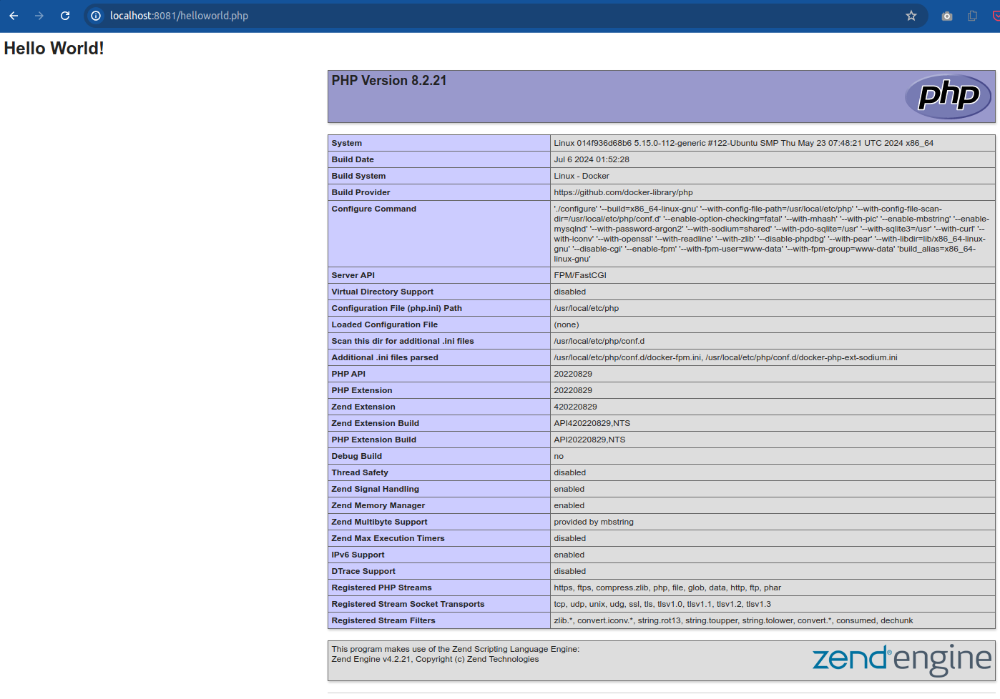

# php-demo

PHP demo application which does not use any database.

To test php functions locally:
```
$ php ./app/helloworld.php
```

## php-demo application Alpine-based Docker image with PHP

A Dockerfile is provided for building a standalone Docker image which contains
php application.

To build the image:
```
$ docker build -t php-demo-alpine-image -f ./dockerfile/php_alpine.Dockerfile .
```

To run it:
```
$ docker run --rm --name php-demo-alpine-container php-demo-alpine-image
```

To inspect it (Alpine does not have `/bin/bash` but has `/bin/sh`):

```
$ docker run --rm -it --name php-demo-alpine-container php-demo-alpine-image /bin/sh
```

## php-demo application Debian-based Docker image with php-fpm


Another Dockerfile is provided for building a Docker image which contains
both application and php-fpm. This image is intended to be used together with
Nginx.

php-fpm is a FastCGI daemon which handles php requests and listens on port
`9000`.

To build and examine only php application container:
```
$ docker build -t php-demo-fpm-debian-image -f ./dockerfile/php_fmp_debian.Dockerfile .
$ docker run -it --rm --name php-demo-fmp-debian-container php-demo-fpm-debian-image /bin/bash
```

Any locally built Docker image can be used in any other Dockerfile on the local machine.


## Nginx + PHP-FPM

A `docker-compose` file is provided for running the application behind Nginx.


Nginx runs in its own container where it listens port `80`.

To run and inspect only nginx container:
```
$ docker run -it --rm  -p 8081:80 --name nginx-container nginx /bin/bash
$ docker stop nginx-container
```

To start both containers:

```
$ docker compose up
```

Optionally, we can request re-building images and re-creating containers:
```
$ docker compose up --build --force-recreate
```

To test PHP, in your browser, go to `http://localhost:8081/helloworld.php`:




To inspect e.g. nginx container which is running:

```
$ docker exec -it <container> /bin/bash
```

We can use container id or name.

To stop both containers:
```
$ docker compose down
```